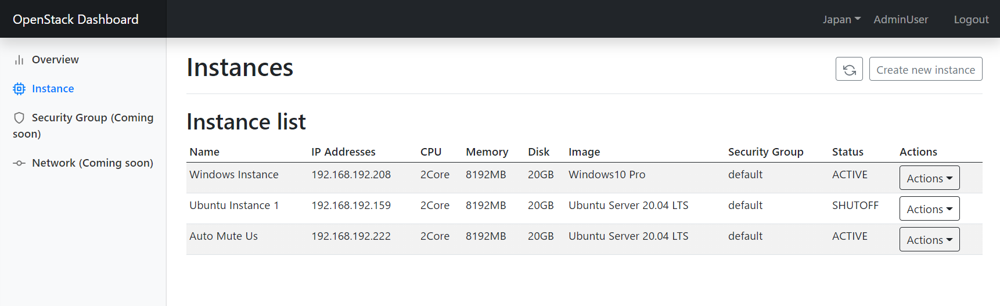

# OpenStack Dashboard



改装中のため，情報は正しくない場合があります。

OpenStack環境向けの簡易ダッシュボードです．  
少人数チームでのLAN内での使用を目的としているため，セキュリティ面も含め簡易的な物です．

# Features
- インスタンス一覧
- インスタンスの作成
    - rootユーザへのパスワード設定
    - パスフレーズでのSSH接続の許可設定
- インスタンスの削除
- インスタンスの起動
- Cloudbase-Initを使用したWindowsインスタンスのサポート
- リージョン切り替え（物理的なリージョンや、OpenStack上のプロジェクト切り替えにも利用可能）

随時追加予定．

# Installation
```
$ npm i
```

# Configuration
`config.json` ファイルを作成して以下の項目について記述してください．  
多くの項目はHorizon上から `OpenStack RCファイル` や `APIアクセス` から確認できます．
```
{
    "SUPER_SECRET": "認証に使用されるJWTのシークレット",
    "Credentials": [
        {
            "REGION_NAME": "管理画面上に表示するリージョン名",
            "OS_AUTH_URL": "OS_AUTH_URL",
            "OS_PROJECT_ID": "OS_PROJECT_ID",
            "OS_PROJECT_NAME": "OS_PROJECT_NAME",
            "OS_USER_DOMAIN_NAME": "OS_USER_DOMAIN_NAME",
            "OS_PROJECT_DOMAIN_ID": "OS_PROJECT_DOMAIN_ID",
            "OS_PROJECT_DOMAIN_NAME": "OS_PROJECT_DOMAIN_NAME",
            "OS_REGION_NAME": "OS_REGION_NAME",
            "OS_INTERFACE": "OS_INTERFACE",
            "OS_IDENTITY_API_VERSION": "OS_IDENTITY_API_VERSION",
            "COMPUTE_API_URL": "COMPUTE_API_URL",
            "IMAGE_API_URL": "IMAGE_API_URL"
        },{
            ..........
        }
    ]
}

```